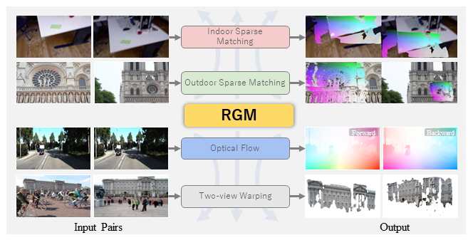
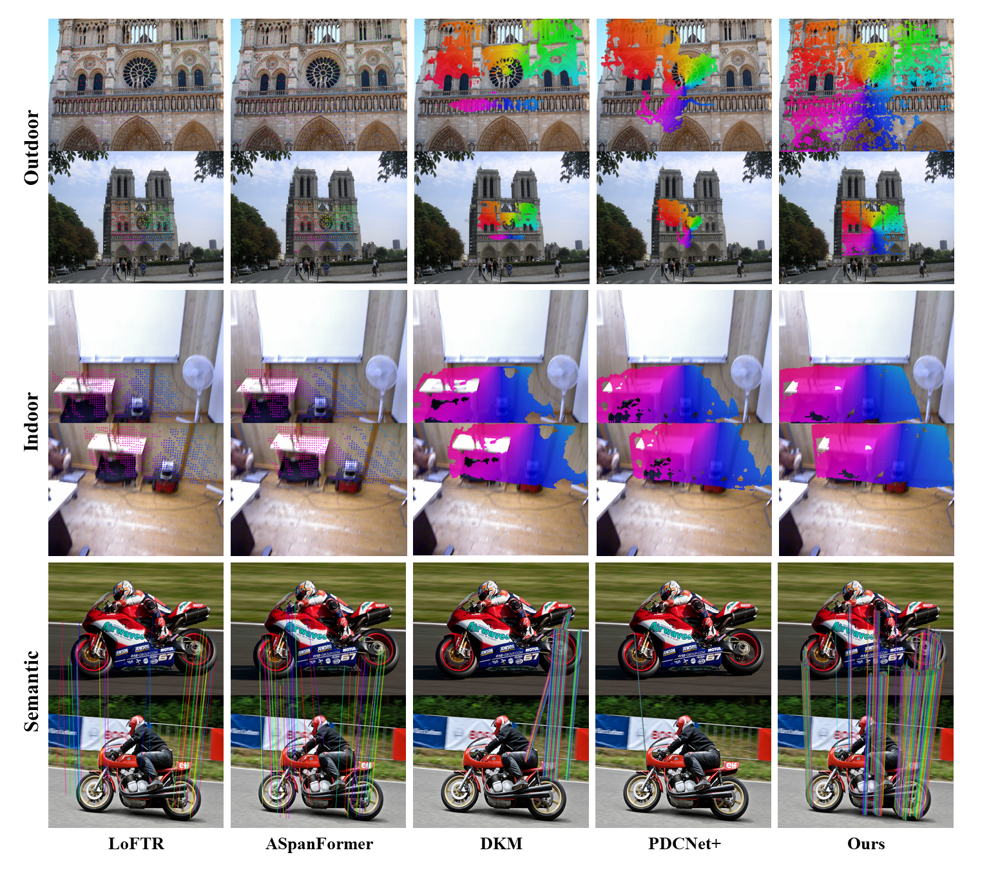

  <h1 align="center">RGM: A Robust Generalist Matching Model</h1>

[Songyan Zhang](https://scholar.google.com/citations?user=EG6WdEQAAAAJ&hl=zh-CN)1*, &nbsp; 
Xinyu Sun1*, &nbsp; 
[Hao Chen](https://stan-haochen.github.io/)1, &nbsp;
Bo Li2, &nbsp;
[Chunhua Shen](https://cshen.github.io/)1

1Zhejiang University, China;
2Northwestern Polytechnical University, China

### [Paper](https://arxiv.org/abs/2310.11755)

## 🚀 Overview

## 📖 Description

Finding corresponding pixels within a pair of images is a fundamental computer
vision task with various applications. Due to the specific requirements of different
tasks like optical flow estimation and local feature matching, previous works are
primarily categorized into dense matching and sparse feature matching focusing
on specialized architectures along with task-specific datasets, which may somewhat hinder the generalization performance of specialized models.
In this paper, we propose a deep model for sparse and dense matching, termed
**RGM** (Robust Generalist Matching). In particular, we elaborately design a cascaded GRU module for refinement by exploring the geometric similarity iteratively at multiple scales following an additional uncertainty estimation module for
sparsification. To narrow the gap between synthetic training samples and realworld scenarios, we build a new, large-scale dataset with sparse correspondence
ground truth by generating optical flow supervision with greater intervals. As
such, we are able to mix up various dense and sparse matching datasets, significantly improving the training diversity. The generalization capacity of our
proposed RGM is greatly improved by learning the matching and uncertainty estimation in a two-stage manner on the large, mixed data. Superior performance
is achieved for zero-shot matching and downstream geometry estimation across
multiple datasets, outperforming the previous methods by a large margin. 

## 🗓️ TODO
- [ ] Release code and models

## 🖼️ Visualized Comparison

## 🎫 License

The content of this project itself is licensed under [LICENSE](LICENSE).
